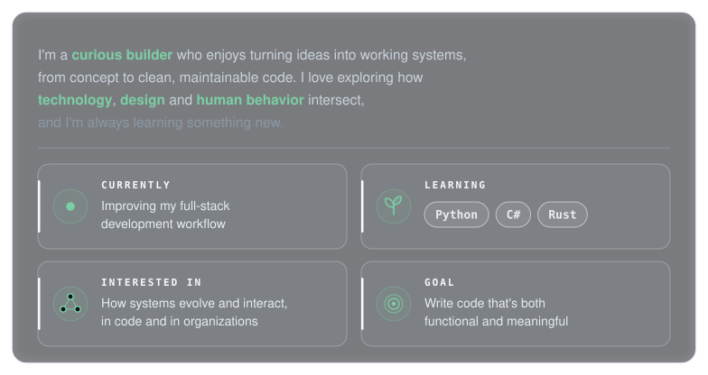
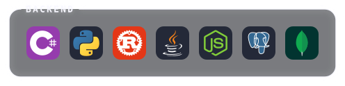
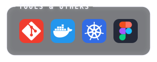

<!-- ═══════════════════════════ HEADER ═══════════════════════════ -->

  

  

<!-- ═══════════════════════════ ABOUT ME ═══════════════════════════ -->
<h2 align="center">ABOUT ME</h2>

  

 

<!-- ═══════════════════════════ TECH STACK ═══════════════════════════ -->
<h2 align="center">TECH STACK</h2>

<!-- <h3 align="left">Backend</h3> -->

  <a href="https://skillicons.dev">
    <!--  -->
    
  </a>

<!-- <h3 align="center">Frontend</h3> -->

  <a href="https://skillicons.dev">
    <!--  -->
    
  </a>

<!-- <h3 align="right">Tools & Others</h3> -->

  <a href="https://skillicons.dev">
    <!--  -->
    
  </a>

 

<!-- ═══════════════════════════ TROPHIES ═══════════════════════════ -->
<h2 align="center">GITHUB TROPHIES</h2>

  

 

<!-- ═══════════════════════════ QUOTE ═══════════════════════════ -->
<h3 align="center">RANDOM DEV QUOTE</h3>

  

<!-- ═══════════════════════════ FOOTER ═══════════════════════════ -->

  

  

<!-- Proudly created with GPRM ( https://gprm.itsvg.in ) -->
